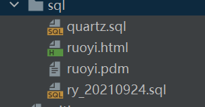
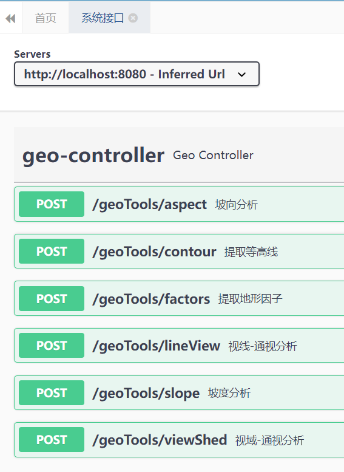

# How to start?

## Step1



+ Run sql/quartz.sql & sql/ry_20210924.sql in MySQL.
+ Modify database configuration(url, username, and password) in master druid in the file(ruoyi-admin/src/main/resources/application-druid.yml).

## Step2

+ Modify the input file path: 

  + ruoyi-admin/src/main/java/com/ruoyi/web/controller/geotools/service/TerrainAnalysis.java 

  ```java
  // input file
  public static String demPath = "assets/data/安徽省_高程_Level_13.tif";
  ```

+ Choose to Run or Debug 'RuoYiApplication' to start the server.

+ http://localhost:6007/
+ userName: admin
+ password: admin123

## Step3



+ you can test with test GeoJson data.(assets/data/test_dss.geojson)


